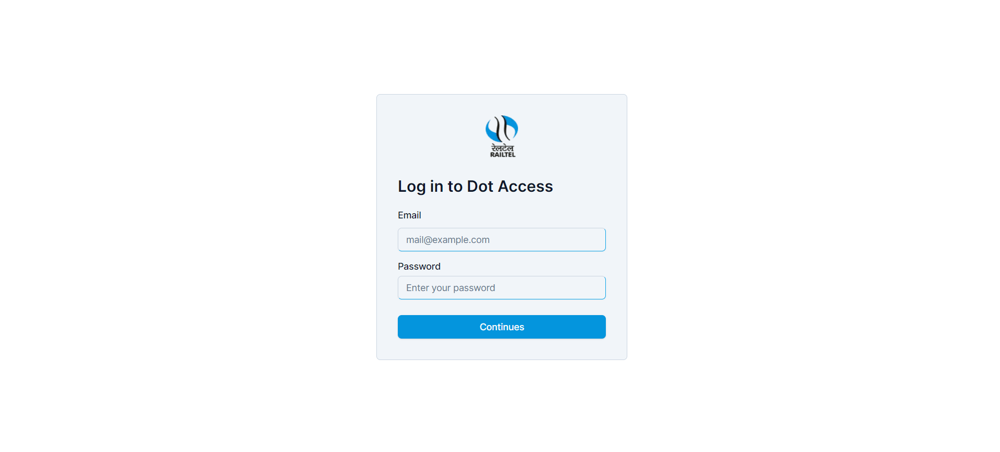
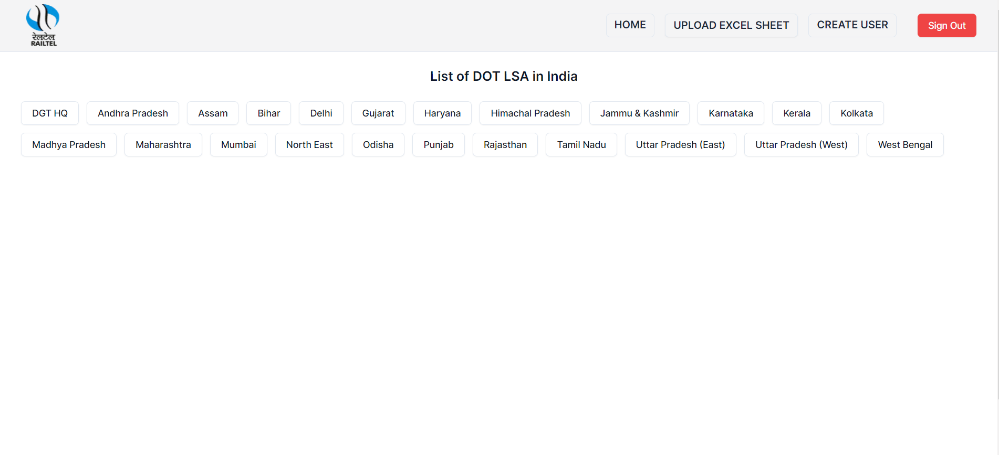
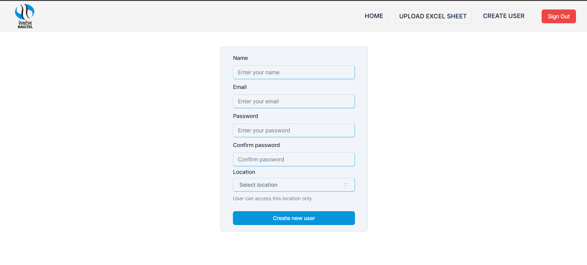
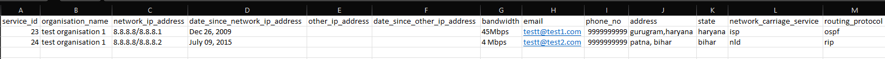
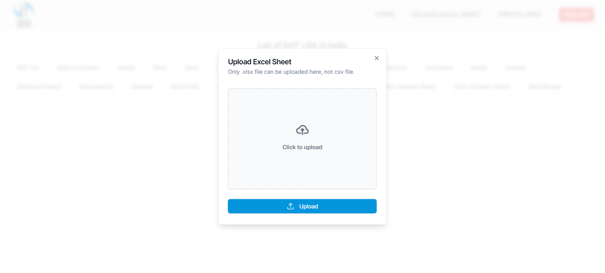

# [DOT LSA](https://dotlsacomp.rcil.gov.in/) portal of RailTel Corporation of India Ltd.

## Introduction:

This is a portal for [RailTel dot lsa services](https://dotlsacomp.rcil.gov.in/).This is a portal for RailTel dot lsa services. dot stands for Department of Telecommunications and lsa stands for Licence Service Area for Telecom Operator. here is a list of all isp, nld and ild povided by RailTel. you can add data with excel sheet, and don't have to create manually, just upload excel sheet and you can also update data manually.

only admin can upload excel sheet and create new user.

## Usage

### open the portals - https://dotlsacomp.rcil.gov.in/

- #### login page

  - without login you can not access anything on this portal.
    

- #### home page

  - here, you can view all list of all dot lsa in India lsa(state) wise.
    

- #### add new user

  - admin can only be created by developer.
  - user can not access this page, only admin can access this page, and create create new user.
    

- #### upload excel sheet with already defined format

- Add new data, click on upload excel sheet with already defined format.
  
  

## Technology Stacks:

- [React](https://react.dev/) - A JavaScript library for building user interfaces
- [Next.js](https://nextjs.org/) - for frontend and backend development.
- [React Hook Form](https://react-hook-form.com/) - for form creation.
- [zod](https://zod.dev/) - for schema validation.
- [prisma](https://prisma.) - is Node.js and TypeScript ORM.
- [tailwindcss](https://tailwindcss.com/) - A utility-first CSS framework.
- [shadcn/ui](https://ui.shadcn.com/) - component library build upon tailwindcss.
- [TanStack Table](https://tanstack.com/table/v8) - Headless UI for building powerful tables.
- [NextAuth.js](https://next-auth.js.org/) - Authentication for Next.js
- [React Datepicker](https://reactdatepicker.com/) - Datepicker component for React.
- [React Toastify](https://fkhadra.github.io/react-toastify/introduction) - Notification library for React.

## Folder Structure:

- route in app/
- api in app/api/

## Installation:

```bash
npm install //install all packages
npm run dev //start the project
```

## Deploy on Ubuntu Server

- used [Deploy (Multiple) Next.js Apps on Ubuntu (with Nginx)](https://ilgaz.medium.com/deploy-multiple-next-js-apps-on-ubuntu-with-nginx-e8081c9bb080) blog
- [How to deploy flask app on Ubuntu 22.04 VPS using Nginx and gunicorn](https://www.codewithharry.com/blogpost/flask-app-deploy-using-gunicorn-nginx/) blog

## Steps:

### Step 1 — Update your system

```
sudo apt update && sudo apt upgrade
```

### Step 2 — Install Nginx

```
sudo apt install nginx
```

### Step 3 — UFW Firewall Configuration

```
sudo ufw allow 'Nginx Full'
```

### Step 4 — Allow OpenSSH

```
ufw allow OpenSSH
```

### Step 5 — Enable Firewall

```
ufw enable
```

### Step 6 — [install node js](https://nodejs.org/en/download/package-manager)

### Step 7 — must check our Ubuntu Nginx default page by visiting our domain name in the browser.


### Step 8 — Install PM2 (PM2 is a process manager for Node.js applications.)

```
npm install pm2 -g
```

### Step 9 — Create a Next.js App

```
npx create-next-app@latest ubuntu-next-app
```

or

already have next js app, then npm install to install package and then

```
npm run build
```

### Step 10 — Configuring Nginx

Create a file named app[it could be anything instead of app] inside /etc/nginx/sites-available

```
sudo vim /etc/nginx/sites-available/app
```

Now copy the below contents to this file:

- for http `listen 80;`
- for https

```
listen 443 ssl;
ssl on;
ssl_certificate /etc/nginx/ssl/rcil.crt;
ssl_certificate_key /etc/nginx/ssl/rcil.key;
```

```
server {
        listen 80;
        //your-domain-name or your server name, using which you can access that server

        server_name your-domain-name;

      gzip on;
        gzip_proxied any;
        gzip_types application/javascript application/x-javascript text/css text/javascript;
        gzip_comp_level 5;
        gzip_buffers 16 8k;
        gzip_min_length 256;

    location /_next/static/ {
                alias /var/www/ubuntu-next-app/.next/static/; # !!! - change to your app name, here app name is ubuntu-next-app
                expires 365d;
                access_log off;
        }

    location / {
                proxy_pass http://127.0.0.1:3000; # !!! - change to your app port, default port is 3000
                proxy_http_version 1.1;
                proxy_set_header Upgrade $http_upgrade;
                proxy_set_header Connection 'upgrade';
                proxy_set_header Host $host;
                proxy_cache_bypass $http_upgrade;
        }
}
```

```
nginx -t
systemctl restart nginx
```

- Activate this configuration by executing this:
  `sudo ln -s /etc/nginx/sites-available/app /etc/nginx/sites-enabled`

### Step 11 - Providing necessary Permissions

- sudo chmod 775 -R /var/www
- sudo chmod 775 -R /var/www/project-name
- `sudo systemctl restart nginx`

### Step 12 — Configure PM2

- Start the app with PM2.

```
pm2 start npm --name "ubuntu-next-app" -- start

//for stop pm2 stop, for delete pm2 delete, for restart pm2 restart
// process-name or all, like pm2 stop all.
```
